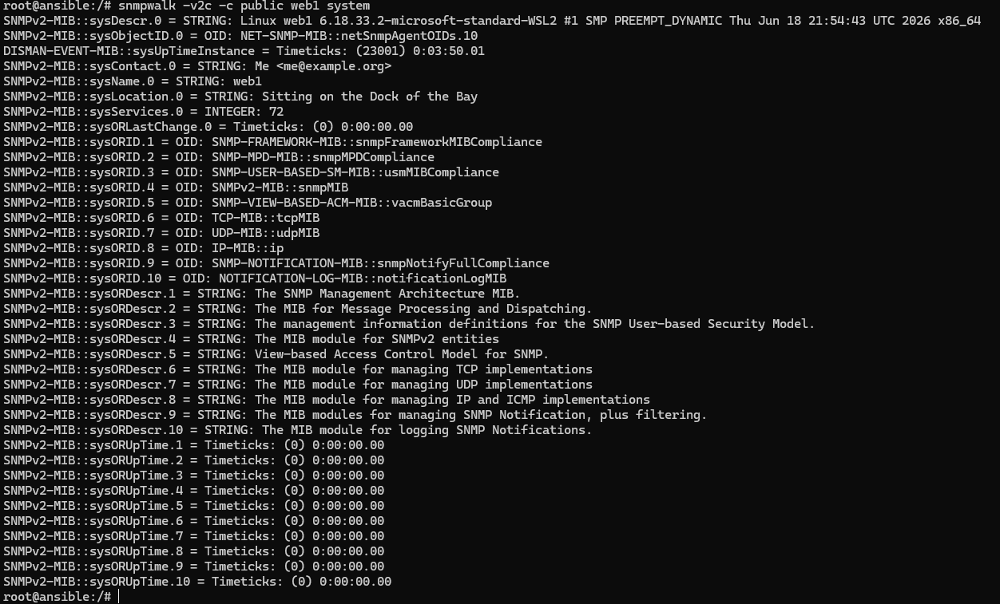
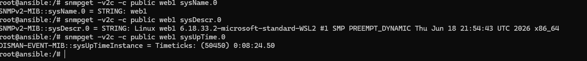
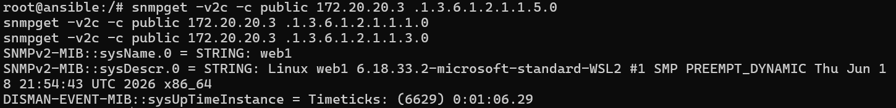
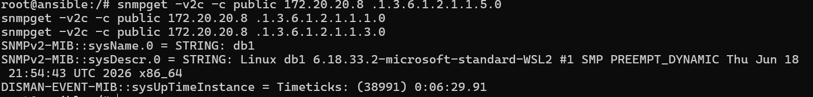
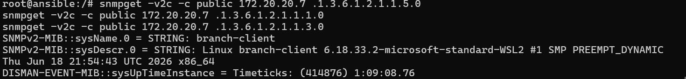

# 1. Johdanto (Mikä on SNMP)

SNMP eli Simple Network Management Protocol on verkkolaitteiden valvontaan ja hallintaan tarkoitettu protokolla. Sen avulla voidaan kerätä tietoa verkossa olevista laitteista ilman, että jokaiseen laitteeseen tarvitsee kirjautua erikseen.

SNMP:n avulla voidaan tarkastella esimerkiksi laitteen nimeä, käyttöjärjestelmää, uptimea, verkkorajapintoja sekä niiden tilaa. Tässä harjoituksessa SNMP:tä käytettiin web1-, db1- ja branch-client-laitteiden valvontaan.

# 2. Asennus (Miten SNMP-agentti asennettiin)

SNMP-agentti asennettiin valvottaville laitteille web1, db1 ja branch-client Linuxin paketinhallinnan avulla. Jokaiselle laitteelle asennettiin snmpd-paketti, jonka jälkeen agentin asetuksia muokattiin niin, että se pystyi vastaanottamaan SNMP-kyselyitä verkon kautta UDP-portissa 161. Lopuksi SNMP-palvelu käynnistettiin uudelleen, jotta tehdyt asetukset tulivat voimaan.

# 3. Kerätyt tiedot (Kuvaukset ja tulosteet)

## 3.1 ansible -> web1 yhteystesti

SNMP-yhteys ansible-palvelimelta web1-palvelimelle toimi onnistuneesti. SNMP-kyselyn perusteella järjestelmän nimi on web1. Palvelin käyttää Linux-käyttöjärjestelmää, jonka kernel-versio on 6.18.33.2-microsoft-standard-WSL2 ja arkkitehtuuri x86_64. SNMP-agentin käyntiaika kyselyhetkellä oli 3 minuuttia ja 50 sekuntia.

## 3.2 SNMP-kyselyt

SNMP-kyselyillä kerättiin web1-palvelimelta seuraavat tiedot:

Järjestelmän nimi: web1

Järjestelmän kuvaus: Linux web1, kernel-versio 6.18.33.2-microsoft-standard-WSL2, arkkitehtuuri x86_64

Käyttöaika: 8 minuuttia ja 24,50 sekuntia

Käytetyt komennot:

snmpget -v2c -c public web1 sysName.0                                                                                                                                                                                          
snmpget -v2c -c public web1 sysDescr.0                                                                                                                                                                                            
snmpget -v2c -c public web1 sysUpTime.0

## 3.3 SNMP-agentit konteilla web1, db1, branch-client ja niistä tehtyjen kyselyiden tulokset

| Laite | Nimi | Käyttöjärjestelmä | Uptime |
| --- | --- | --- | --- |
| web1 | web1 | Linux (WSL2) | 0:01:06 |
| db1 | db1 | Linux (WSL2) | 0:06:29 |
| branch-client | branch-client | Linux (WSL2) | 1:09:08 |

Laitetiedot kerättiin SNMP:n avulla OID-kyselyillä. Kyselyissä haettiin laitteen nimi (sysName.0), järjestelmän kuvaus (sysDescr.0) ja käyttöaika (sysUpTime.0) numeeristen OID-tunnisteiden avulla.

**web1:**

**db1:**

**branch-client:**

# 4. Verkkorajapinnat (SNMP:n avulla kerätyt rajapintatiedot)

Verkkorajapintojen listaus:

SNMP-kyselyllä web1-palvelimelta löytyi kolme verkkorajapintaa: lo, eth0 ja eth1. Lo on järjestelmän sisäinen loopback-rajapinta. Eth0 yhdistää kontin Containerlabin hallintaverkkoon. Eth1 yhdistää web1-palvelimen varsinaiseen palvelinverkkoon 10.10.20.0/24, joten laitteen verkkoyhteyden muodostava harjoitusverkon rajapinta on eth1.

# 5. OID-analyysi (OID-objektien käyttötarkoitus)

| OID | Tarkoitus |
| --- | --- |
| sysName.0 | Laitteen nimi eli hostname. |
| sysDescr.0 | Laitteen kuvaus, yleensä tietoa käyttöjärjestelmästä, laitemallista ja ohjelmistoversiosta. |
| sysUpTime.0 | Aika, jonka SNMP-agentti/laite on ollut käynnissä viimeisestä uudelleenkäynnistyksestä. |
| ifDescr | Verkkoliitännän kuvaus tai nimi, esimerkiksi GigabitEthernet0/1 |
| ifOperStatus | Verkkoliitännän tämänhetkinen toimintatila, esimerkiksi up, down tai testing. |

# 6. Pohdinta (Omat havainnot SNMP:n hyödyistä ja rajoituksista

Harjoituksen perusteella SNMP on hyödyllinen verkonhallinnassa, koska sen avulla voidaan kerätä tietoa useilta laitteilta keskitetysti. SNMP:n avulla saatiin esimerkiksi laitteen nimi, käyttöjärjestelmän tiedot, uptime sekä tietoa verkkorajapinnoista OID-kyselyiden avulla. Harjoituksessa tuli myös esille, että SNMPv2c on melko yksinkertainen käyttää, mutta sen tietoturva on rajallinen, koska community string ei ole salattu. Tämän vuoksi SNMPv3 olisi parempi vaihtoehto esimerkiksi yritys- ja tuotantoverkoissa, joissa tietoturva on tärkeä. Harjoituksen aikana opin myös, miten SNMP-agentti asennetaan ja määritetään sekä miten kyselyitä tehdään managerilta useille eri laitteille.

