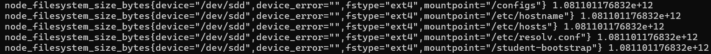
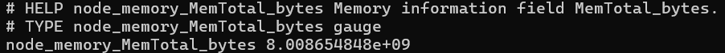
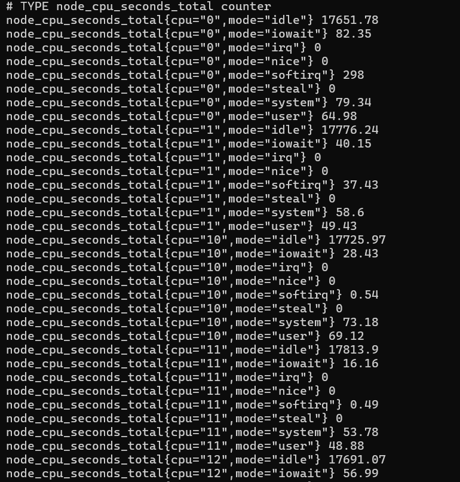
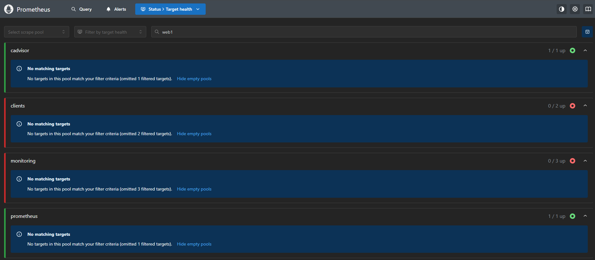
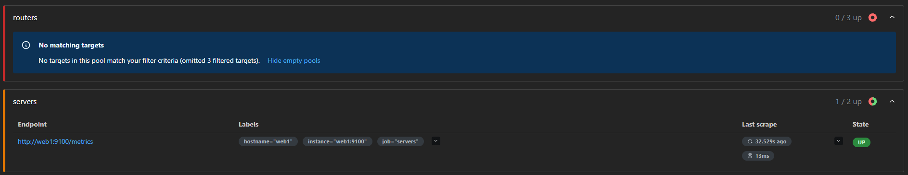
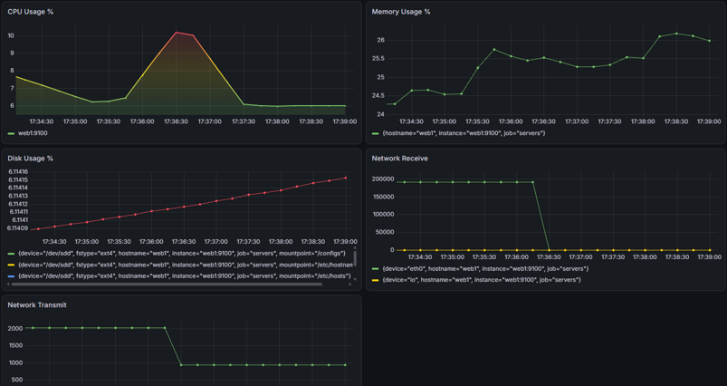
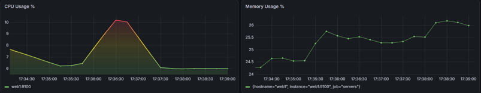
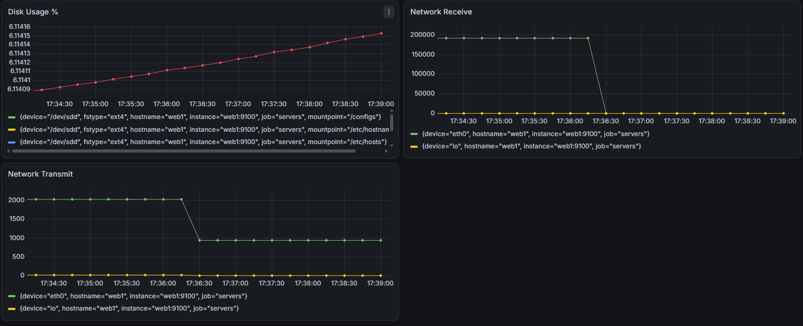

# Viikko 3 – Prometheus, Node Exporter ja Grafana

## 1. Johdanto

Monitorointi tarkoittaa palveluiden, laitteiden ja verkkojen toiminnan jatkuvaa seurantaa. Sen avulla voidaan havaita häiriöitä, seurata resurssien käyttöä ja tunnistaa ongelmia ennen kuin ne vaikuttavat käyttäjiin. Monitorointi on tärkeää ylläpidossa, koska se auttaa varmistamaan palveluiden saatavuuden ja nopeuttaa vianetsintää.

Prometheus on monitorointijärjestelmä, joka kerää säännöllisesti mittaustietoja valvottavista kohteista ja tallentaa ne aikasarjoina. Tässä harjoituksessa web1-palvelimen Node Exporter tarjoaa Prometheukselle tietoja esimerkiksi CPU:n toiminnasta, muistinkäytöstä, levytilasta ja verkkoliikenteestä. Grafanan avulla kerätyt tiedot esitetään dashboardin kuvaajina.

Harjoituksen tavoitteena on ottaa käyttöön palvelimen monitorointi, luoda Grafanaan dashboard ja tarkastella kuormituksen vaikutuksia mittareihin. Lisäksi vertailen Prometheusta SNMP:tä ja pohdin monitoroinnin hyötyjä ylläpidossa ja vianetsinnässä.

## 2. Node Exporterin käyttöönotto

Kirjauduin web1-konttiin ja asensin tarvittavat wget- ja tar-työkalut. Latasin Node Exporterin asennuspaketin GitHubista, purin sen ja siirryin purettuun hakemistoon. Käynnistin ohjelman komennolla ./node_exporter ja jätin terminaalin auki, jotta mittaripalvelu pysyi käynnissä.

Node Exporterin käynnistämisen jälkeen avasin toisen terminaaliyhteyden web1-konttiin ja tarkistin ohjelman toiminnan komennolla curl http://localhost:9100/metrics. Vastauksena sain mittaustietoja esimerkiksi CPU käyttöajasta, muistin kokonaismäärästä ja tiedostojärjestelmien koosta. Tulosteen perusteella varmistin, että Node Exporter toimi ja tarjosi mittareita Prometheuksen kerättäväksi.

Ohessa muutamia mittareita tulostettuna:

Tiedostojärjestelmän kokonaiskoko tavuina:

Muistin kokonaismäärä tavuina:

CPU:n eri toimintatiloissa kertynyt aika sekunteina:

## 3. Prometheus

Tarkistin Prometheuksen Target health -sivulta, onnistuiko mittareiden kerääminen web1-palvelimelta. Kohde näkyi servers-ryhmässä UP-tilassa, mikä osoitti mittareiden haun onnistuneen osoitteesta http://web1:9100/metrics.

Kaikki ympäristön valvontakohteet eivät olleet UP-tilassa, mutta tässä harjoituksessa keskityin web1-palvelimen seurantaan.

## 4. Dashboard

Onnistunut tietolähdeyhteys Prometheus -> Grafana:

Uusi luotu dashboard, jossa luodut mittarit CPU:lle, muistille, levytilalle, verkkoliikenteille (saapuva ja lähtevä):

Käytetyt PromQL-kyselyt:

- CPU = 100 - (avg by(instance)
(rate(node_cpu_seconds_total{mode="idle"}[5m])) * 100)

- Muisti = (node_memory_MemTotal_bytes -
 node_memory_MemAvailable_bytes) / node_memory_MemTotal_bytes * 100

- Levytila = 100 - ( node_filesystem_avail_bytes / node_filesystem_size_bytes * 100 )

- Verkkoliikenne (saapuva) = rate(node_network_receive_bytes_total[5m])
  
- Verkkoliikenne (lähtevä) = rate(node_network_transmit_bytes_total[5m])
  

## 5. Kuormitustesti

Kuormitukset, aloitettu aikajanalla 17:35:

Havainnot kuormituksista:

- CPU-käyrä: Käyrä nousi kuormituksen aikana hetkellisesti ja laski sen päätyttyä takaisin lähtötasolle.

- Levytilan käyttö: Käyrä nousi tasaisesti, mutta muutos oli hyvin pieni.

- Verkkoliikenne: Muutoksia näkyi. Vastaanotettu ja lähetetty liikenne vähenivät kuormituksen aikana.

## 6. SNMP vs Prometheus

SNMP ja Prometheus soveltuvat molemmat monitorointiin, mutta niiden toimintatavat eroavat toisistaan. SNMP on tiedonkeruussa käytettävä protokolla, kun taas Prometheus on mittaustietoja keräävä ja tallentava monitorointijärjestelmä. Alla olevassa taulukossa vertailen niiden ominaisuuksia ja käyttökohteita.

| Ominaisuus | SNMP | Prometheus |
| --- | --- | --- |
| Tiedonkeruu | Tietoja kysellään laitteiden SNMP-agenteilta. | Mittareita haetaan säännöllisesti esimerkiksi Node Exporterista. |
| Käyttöönotto | Laitteelle määritetään SNMP-asetukset ja käyttöoikeudet. | Asennetaan exporter ja lisätään valvottava kohde Prometheuksen asetuksiin. |
| Mittarien määrä | Riippuu laitteen tarjoamista MIB-tiedoista. | Riippuu exporterista. Node Exporter tarjoaa paljon palvelimen mittareita. |
| Visualisointi | Kuvaajat vaativat erillisen valvontaohjelman. | Mittareita voi tarkastella Prometheuksessa ja visualisoida Grafanassa. |
| Hälytysmahdollisuudet | Trap-ilmoitukset ja valvontaohjelman hälytykset. | Hälytyssäännöt ja ilmoitusten välitys Alertmanagerilla. |
| Soveltuvuus pilviympäristöihin | Sopii erityisesti verkkolaitteiden valvontaan. | Sopii hyvin pilvipalveluiden ja konttiympäristöjen valvontaan. |

Vertailun perusteella SNMP sopii erityisesti reitittimien ja kytkimien valvontaan. Prometheuksen etuna on mittaustietojen tallentaminen aikasarjoina, jolloin muutoksia voidaan tarkastella pidemmältä ajalta. PromQL-kyselyillä tietoja voidaan käsitellä ja vertailla. SNMP:n avulla kerättyjen tietojen historiatallennukseen ja esittämiseen tarvitaan erillinen valvontajärjestelmä.

Tässä harjoituksessa Node Exporter tarjosi palvelimen mittarit Prometheukselle, ja Grafanan avulla pystyin seuraamaan niitä kuvaajina. Ratkaisu helpotti kuormituksen muutosten tarkastelua. SNMP ja Prometheus voivat myös täydentää toisiaan ympäristössä, jossa valvotaan sekä verkkolaitteita että palvelimia.

## 7. Yhteenveto

Harjoituksessa opin, miten Prometheus, Node Exporter ja Grafana toimivat yhdessä palvelimen monitoroinnissa. Opin ottamaan Node Exporterin käyttöön, tarkistamaan mittareiden keruun ja lisäämään Prometheuksen Grafanan tietolähteeksi. Lisäksi opin luomaan dashboardin, josta pystyin seuraamaan esimerkiksi CPU:ta ja muistin käyttöä, levytilaa sekä verkkoliikennettä.

Kuormitustestien avulla opin tarkastelemaan palvelimen toiminnan muutoksia kuvaajista. Opin myös, ettei samaan aikaan tapahtuva muutos välttämättä johdu kuormituksesta. Harjoitus auttoi ymmärtämään monitoroinnin hyötyjä ongelmien havaitsemisessa ja selvittämisessä sekä SNMP ja Prometheuksen eroja.
