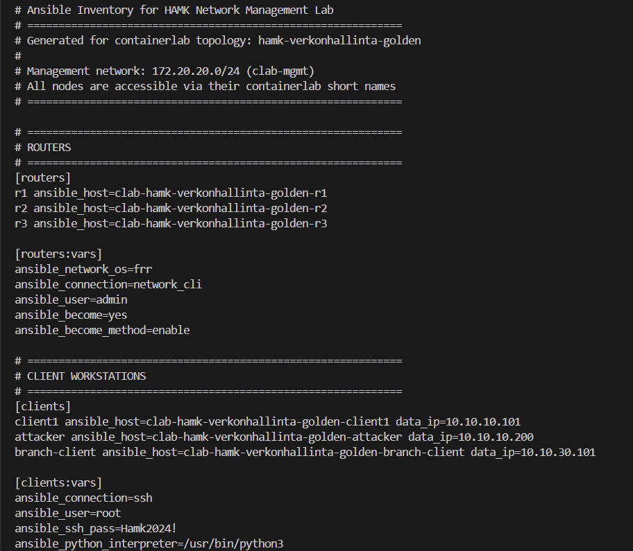
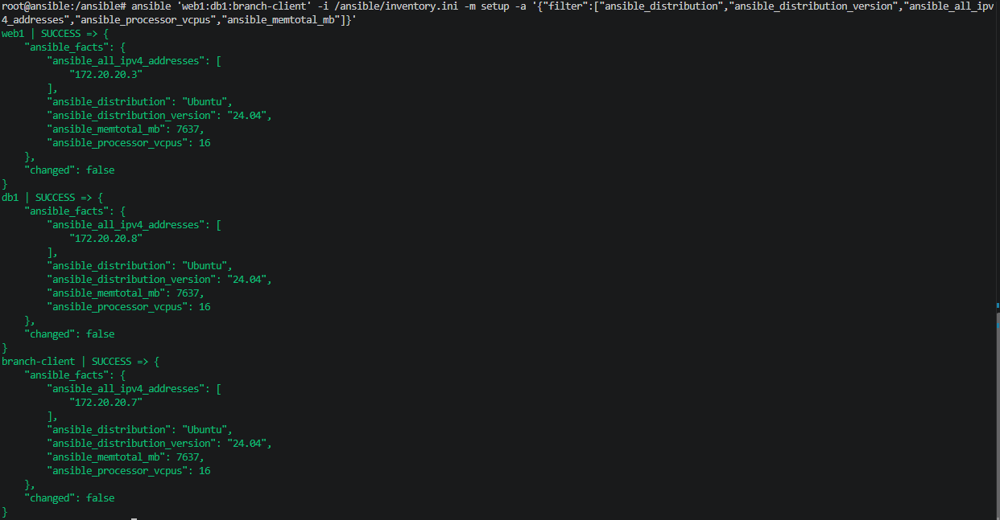
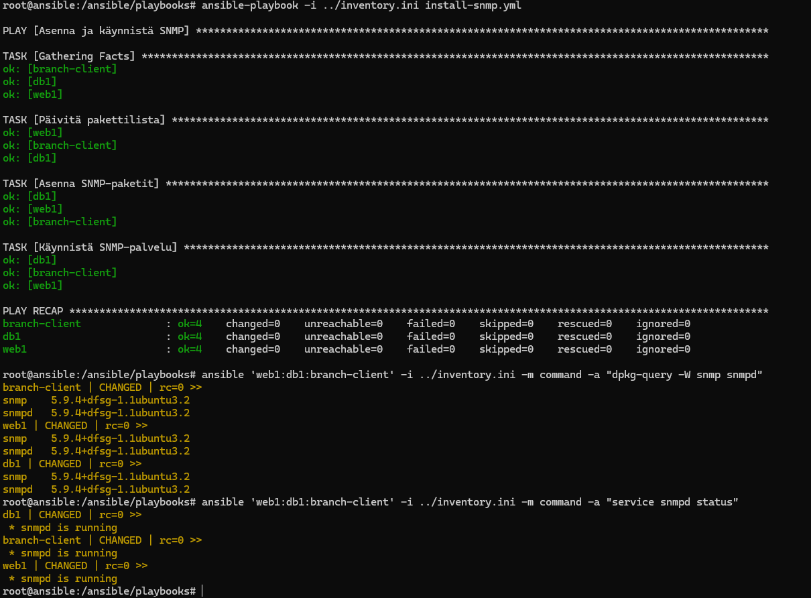
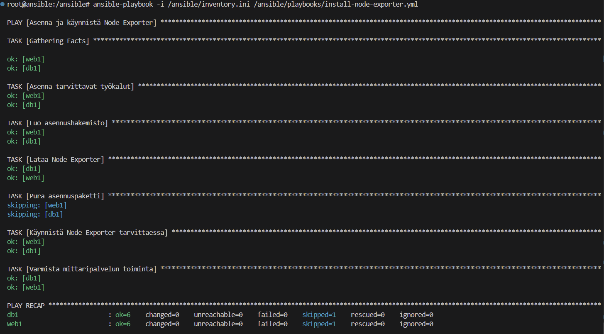

# Verkonhallinta Vko4

## 1. Johdanto

Infrastructure as Code eli infrastruktuuri koodina tarkoittaa ympäristön asetusten ja ylläpitotehtävien määrittelyä tiedostoihin, joiden avulla muutokset voidaan suorittaa automaattisesti. Näin samoja asennuksia ja määrityksiä voidaan toistaa useille koneille. Tiedostot toimivat myös dokumentaationa, ja niiden muutoksia voidaan seurata versionhallinnassa.

Tässä harjoituksessa käytin Ansiblea labraympäristön koneiden hallintaan. Tutustuin inventory-tiedoston laitteisiin ja ryhmiin sekä testasin hallintayhteyksiä. Tämän jälkeen automatisoin SNMP ja Node Exporterin asennukset YAML-muotoisilla playbookeilla ja tarkistin niiden toiminnan. Keräsin myös kohdekoneiden järjestelmätiedot taulukkoon.

## 2. Inventory

Tarkistin Ansible-palvelimen inventory-tiedoston komennolla cat /ansible/inventory.ini. Inventory määrittelee hallittavat kohteet, niiden ryhmät ja yhteysasetukset. Kohteisiin otetaan yhteys konttien nimien avulla.

Inventoryn pääryhmät ja niihin kuuluvat kohteet ovat:

- routers – r1, r2, r3

- clients – client1, attacker, branch-client

- servers – web1, db1

- monitoring – prometheus, grafana, zabbix, cadvisor

- management – ansible

Laitteita on ryhmitelty myös verkkosegmenttien ja käyttötarkoitusten mukaan. Esimerkiksi ubuntu_hosts-ryhmään kuuluvat client1, web1, db1 ja branch-client. Sama laite voi kuulua useaan ryhmään. Ryhmittelyn avulla voi kohdistaa komennot ja asennukset halutuille koneille sekä määrittää yhteiset yhteysasetukset koko ryhmälle.

Kuva inventoryn alkuosasta:



Järjestelmätietojen keräys suodatetusti haluttujen tietojen mukaisesti:



Keräsin Ansiblen setup-moduulilla web1-, db1- ja branch-client-koneiden järjestelmätiedot. Rajasin tulosteeseen käyttöjärjestelmän ja sen version, IPv4-osoitteet, loogisten suorittimien määrän sekä kokonaismuistin.

| Kohde | Käyttöjärjestelmä | IP-osoite | Loogisia suorittimia (prosessoreita) | Muisti |
| --- | --- | --- | --- | --- |
| web1 | Ubuntu 24.04 | 172.20.20.3 | 16 | 7637 MiB |
| db1 | Ubuntu 24.04 | 172.20.20.8 | 16 | 7637 MiB |
| branch-client | Ubuntu 24.04 | 172.20.20.7 | 16 | 7637 MiB |

## 3. SNMP Playbook

Loin tiedoston install-snmp.yml, jonka avulla automatisoin SNMP-pakettien asennuksen web1-, db1- ja branch-client-koneille. Playbook päivitti pakettilistan, varmisti snmp- ja snmpd-pakettien asennuksen sekä käynnisti SNMP-palvelun.

install-snmp.yml -playbookin sisältö:

```yaml
---
- name: Asenna ja käynnistä SNMP
  hosts: web1:db1:branch-client
  become: false
  tasks:
    - name: Päivitä pakettilista
      ansible.builtin.apt:
        update_cache: true

    - name: Asenna SNMP-paketit
      ansible.builtin.apt:
        name:
          - snmp
          - snmpd
        state: present

    - name: Käynnistä SNMP-palvelu
      ansible.builtin.service:
        name: snmpd
        state: started
        use: sysvinit
```



Varmistin asennuksen kaikilla kolmella kohteella komennolla dpkg-query -W snmp snmpd. Molempien pakettien versio oli kaikilla koneilla 5.9.4+dfsg-1.1ubuntu3.2.

Tarkistin lisäksi palvelun tilan komennolla service snmpd status. Kaikki kohteet palauttivat ilmoituksen snmpd is running. Tulosten perusteella SNMP-paketit olivat asennettuina ja palvelu käynnissä kaikilla tehtävässä määritellyillä kohdekoneilla.

## 4. Node Exporter Playbook

Loin tiedoston install-node-exporter.yml, jonka avulla automatisoin Node Exporterin käyttöönoton web1- ja db1-koneille. Playbook varmisti tarvittavien työkalujen asennuksen, loi asennushakemiston, latasi Node Exporterin asennuspaketin ja purki sen. Lopuksi se käynnisti ohjelman tarvittaessa taustalle ja tarkisti mittaripalvelun toiminnan.

install-node-exporter.yml -playbookin sisältö kahdessa osassa:

Osa 1/2:

```yaml
---
- name: Asenna ja käynnistä Node Exporter
  hosts: web1:db1
  become: false
  vars:
    node_exporter_version: "1.10.2"
    node_exporter_package: "node_exporter-{{ node_exporter_version }}.linux-amd64"
    node_exporter_directory: "/opt/node_exporter"
  tasks:
    - name: Asenna tarvittavat työkalut
      ansible.builtin.apt:
        name:
          - tar
          - gzip
          - procps
          - ca-certificates
        state: present
        update_cache: true

    - name: Luo asennushakemisto
      ansible.builtin.file:
        path: "{{ node_exporter_directory }}"
        state: directory
        mode: "0755"
```

Osa 2/2:

```yaml
    - name: Lataa Node Exporter
      ansible.builtin.get_url:
        url: "https://github.com/prometheus/node_exporter/releases/download/v{{ node_exporter_version }}/{{ node_exporter_package }}.tar.gz"
        dest: "{{ node_exporter_directory }}/{{ node_exporter_package }}.tar.gz"
        mode: "0644"

    - name: Pura asennuspaketti
      ansible.builtin.unarchive:
        src: "{{ node_exporter_directory }}/{{ node_exporter_package }}.tar.gz"
        dest: "{{ node_exporter_directory }}"
        remote_src: true
        creates: "{{ node_exporter_directory }}/{{ node_exporter_package }}/node_exporter"

    - name: Käynnistä Node Exporter tarvittaessa
      ansible.builtin.shell: |
        if pgrep -x node_exporter > /dev/null; then
          echo "already_running"
        else
          nohup {{ node_exporter_directory }}/{{ node_exporter_package }}/node_exporter \
            > /var/log/node_exporter.log 2>&1 < /dev/null &
          echo "started"
        fi
      register: exporter_start
      changed_when: "'started' in exporter_start.stdout"

    - name: Varmista mittaripalvelun toiminta
      ansible.builtin.uri:
        url: http://localhost:9100/metrics
        return_content: true
        status_code: 200
      register: exporter_metrics
      until:
        - exporter_metrics.status == 200
        - "'node_exporter_build_info' in (exporter_metrics.content | default(''))"
      retries: 5
      delay: 2
```

Tulokset:



Suoritin Node Exporter -playbookin web1- ja db1-koneille. Molemmilla kohteilla kuusi tehtävää onnistui ja yksi ohitettiin. Paketin purkaminen ohitettiin, koska ohjelmatiedosto oli jo olemassa. Node Exporter oli valmiiksi käynnissä, joten uusia prosesseja ei tarvinnut käynnistää.

Mittaripalvelun tarkistus onnistui molemmilla koneilla, joten Node Exporter tarjosi mittaustietoja osoitteessa http://localhost:9100/metrics. Ajon yhteenvedossa kummallakin kohteella oli changed=0, unreachable=0 ja failed=0. Suoritus onnistui siis ilman muutoksia tai virheitä.

## 5. Vertailu

Aiemmissa harjoituksissa asensin SNMP ja Node Exporterin käsin suorittamalla komennot erikseen jokaisella kohdekoneella. Menetelmä auttoi ymmärtämään asennuksen vaiheet, mutta samojen komentojen toistaminen usealla koneella lisäsi työmäärää ja virheiden mahdollisuutta.

Ansiblella määrittelin asennusvaiheet playbookiin ja suoritin ne usealle koneelle yhdellä komennolla. SNMP-playbook kohdistettiin kolmelle koneelle ja Node Exporter -playbook kahdelle. Playbookien laatiminen vaati aluksi työtä, mutta samoja tiedostoja voidaan hyödyntää myöhemmin uudelleen. Tulosteista pystyin myös tarkistamaan, mitkä tehtävät onnistuivat ja missä tapahtui muutoksia.

Automaation hyötyjä ovat ajansäästö, toistettavuus ja yhtenäiset asetukset. Samat tehtävät suoritetaan kaikille valituille kohteille samalla tavalla. Playbookit toimivat myös dokumentaationa, ja niiden muutoksia voidaan seurata GitHubissa. Automaatio edellyttää kuitenkin toimivia yhteyksiä ja testattuja määrityksiä. Harjoituksessa SSH-palvelut piti käynnistää ennen kuin kohdekoneiden hallinta onnistui.

Automaatio on käytännössä välttämätöntä suurissa ja nopeasti muuttuvissa ympäristöissä, joissa ylläpidetään kymmeniä tai satoja palvelimia. Esimerkiksi ohjelmistojen asennukset, tietoturvapäivitykset ja uusien palvelimien käyttöönotto veisivät käsin paljon aikaa. Yksittäisessä pienessä tehtävässä käsin tekeminen voi olla nopeampaa, mutta toistuvissa ylläpitotehtävissä automaatiosta saadaan selvä hyöty.

## 6. Yhteenveto

Harjoituksessa opin käyttämään Ansiblea usean koneen keskitettyyn hallintaan. Opin tarkastelemaan inventoryn rakennetta, testaamaan hallintayhteyksiä ja suorittamaan playbookeja. Lisäksi automatisoin SNMP ja Node Exporterin käyttöönottoa sekä keräsin kohdekoneiden järjestelmätietoja setup-moduulilla.

Harjoituksen aikana ratkaisin SSH-palveluiden käynnistykseen, tiedostopolkuihin ja terminaalin alueasetuksiin liittyviä ongelmia. Opin myös tulkitsemaan Ansiblen tulosteita ja erottamaan onnistuneet tehtävät, tehdyt muutokset ja epäonnistuneet yhteydet toisistaan.

Harjoitus auttoi ymmärtämään Infrastructure as Code -periaatetta käytännössä. Kun asennusvaiheet on määritelty playbookiin, niitä voidaan toistaa useille koneille ja hyödyntää myöhemmin uudelleen. Jatkossa voisin käyttää Ansiblea esimerkiksi ohjelmistojen asennuksiin, asetusten hallintaan ja toistuviin ylläpitotehtäviin.
